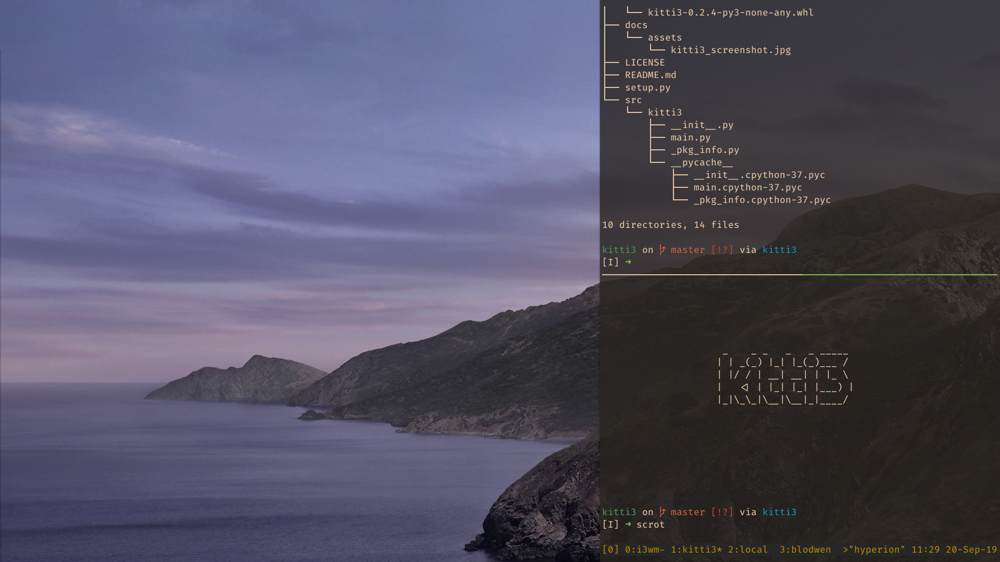

# Kitti3 - Kitty drop-down manager for i3 & Sway
Kitti3 turns [Kitty](https://sw.kovidgoyal.net/kitty/) into a drop-down, Quake-style 
floating terminal for the [i3](https://i3wm.org/) and [Sway](https://swaywm.org/) window
managers.

#### Features
- i3 & Sway native, *flicker-free* visibility toggling 
- Multi-monitor support with adaptive resizing and alignment to the active monitor
- Flexible choice of terminal position; freely selectable dimensions
- Great responsiveness by leveraging the i3/Sway IPC API
- Support for multiple concurrent instances
- Kitty argument forwarding (e.g. `--session`)




## Installation and setup
Kitti3 is a Python 3 package that [lives on PYPI](https://pypi.org/project/kitti3/). 
1. To install Kitti3, either:
    - use [pipx](https://github.com/pypa/pipx) (recommended):
        ```commandline
        $ pipx install kitti3
        ```
    - or use pip:
        ```commandline
        $ pip install kitti3 --user
        ```
    - or copy [main.py](https://github.com/LandingEllipse/Kitti3/blob/master/src/kitti3/main.py)
    to somewhere on your $PATH, rename it to `kitti3` and make it executable. *(Note:
    in this case it's your responsibility to satisfy the Python [dependencies](#dependencies))* 

2. Ensure that Kitti3 is reachable (e.g. `$ which kitti3`); the WM won't necessarily complain later 
if it isn't!

3. Add the following to your `~/.config/<WM>/config`:
    ```commandline
    exec_always --no-startup-id kitti3
    bindsym $mod+n nop kitti3
    ```
    where `$mod+n` refers to your keyboard shortcut of choice. Take a look at the 
    [configuration](#configuration) section below for a list of the CLI options that
    `kitti3` accepts.
    
4. Restart i3/Sway inplace (e.g. `$mod+Shift+r`)

5. Trigger the shortcut to verify that the terminal appears (slight flicker / tiling 
noise is normal on the first toggle when Kitty is spawned and floated by Kitti3)


## Configuration
Kitti3 does not make use of a dedicated configuration file, but its behaviour can be 
modified via commandline options:
```commanline
$ kitti3 -h
usage: kitti3 [-h] [-n NAME] [-p {LT,LC,LB,CT,CC,CB,RT,RC,RB}]
              [-s SHAPE SHAPE] [-v]

Kitti3: i3/Sway drop-down manager for Kitty. Arguments following '--' are
forwarded to the Kitty instance

optional arguments:
  -h, --help            show this help message and exit
  -n NAME, --name NAME  name/tag used to identify this Kitti3 instance. Must
                        match the keybinding used in the i3/Sway config (e.g.
                        `bindsym $mod+n nop NAME`)
  -p {LT,LC,LB,CT,CC,CB,RT,RC,RB}, --position {LT,LC,LB,CT,CC,CB,RT,RC,RB}
                        where to position the Kitty window within the active
                        workspace, e.g. 'TL' for Top Left, or 'BC' for Bottom
                        Center (character order does not matter)
  -s SHAPE SHAPE, --shape SHAPE SHAPE
                        dimensions (x, y) of the Kitty window, each as a
                        fraction of the workspace size, e.g. '1.0 0.5' for
                        full width, half height 
  -v, --version         show kitti3's version number and exit
```
### Command line options
#### `-n, --name` (default: `kitti3`)
The name option provides the string identifier used to connect a user-defined i3/Sway 
keybinding to the Kitti3 instance. Specifically, Kitti3 will listen to IPC events
and toggle the visibility of Kitty when it encounters the bindsym command `nop NAME` - 
hence the requirement to include a "no-op" bindsym declaration in your config.

The name option value is also used internally to associate Kitti3 with the Kitty 
instance it manages (the latter is forwarded the argument `--name NAME`). For this
reason it is worth ensuring that an instance name is chosen which is unlikely to collide
with that of another application's window; it would be wise to avoid the likes of 
`slack` or `discord`.

#### `-p, --position` (default: `RT`)
The position option accepts a 2-char ID, which sets the Kitty window's location within 
the workspace (and implicitly in which directions to grow the window's dimensions).
The window can be placed in one of nine locations:

| &nbsp;     | Left | Center | Right |
|------------|------|--------|-------|
| **Top**    | LT   | CT     | RT    |
| **Center** | LC   | CC     | RC    |
| **Bottom** | LB   | CB     | RB    |

The case and order of the characters are inconsequential (i.e. `LB` == `bl`).

Note that for backwards compatibility, the position option additionally accepts an older
location format, with the following mapping. The default position if none is provided is
actually `right` (refer to the note on shape below for why this matters). These choices
will be removed in a future
release.

| Old    | New |
|--------|-----|
| top    | LT  |
| bottom | LB  |
| left   | LT  |
| right  | RT  |

#### `-s, --shape` (default: `1.0 0.3`)
The shape option specifies the (x, y) dimensions of the Kitty window relative to its 
workspace. Allowed values are in the range [0, 1], where `1.0` corresponds to the full
extent of the given workspace axis.

Note that for backwards compatibility, shape values will be interpreted in (y, x) order
when position is set to `left` or `right`.

### Examples
#### Centered terminal with custom name and argument forwarding
The following i3/Sway configuration snippet produces a Kitty terminal positioned at the 
center of the workspace, filling half its height and 30% of its width. It is assigned 
the custom name "caterwaul", and the argument `--session ~/.kitty_session` is forwarded
to Kitty when it is spawned.
```commandline
exec_always --no-startup-id kitti3 -n caterwaul -p CC -s 0.5 0.3 -- --session ~/.kitty_session
bindsym $mod+n nop caterwaul
```
Note that any arguments following `--` are ignored by Kitti3 and forwarded to the 
terminal when it is spawned.

#### Multiple instances
Multiple Kitti3 instances (and hence Kitty windows) can be run concurrently; they just
need to be distinguished by unique instance names to avoid crosstalk, e.g.:
```commandline
exec_always --no-startup-id kitti3 -n almond -p CT -s 0.5 0.25
bindsym $mod+t nop almond 
exec_always --no-startup-id kitti3 -n bubblegum -p CB -s 1.0 0.4
bindsym $mod+b nop bubblegum
```

### Updating the configuration
Kitti3 must be respawned to trigger any changes made to its command line arguments in 
the i3/Sway config file. This can most easily be achieved by restarting the WM inplace 
(e.g. `$mod+Shift+r`), which because of the use of `exec_always` will spawn a new 
instance of Kitti3. The old instance will automatically exit when it detects a restart 
event, so you should not see any stray instances hanging around.

## Dependencies
- [Kitty](https://sw.kovidgoyal.net/kitty/) (duh)
- i3 > 4 or Sway >= 1.6 (you should also be fine on the latest git)
- Python >= 3.6 
- [i3ipc-python](https://github.com/altdesktop/i3ipc-python) (pip(x) will pull in >=2.0)

## Alternatives
*The following ~~rant~~ discussion was written some years ago and might not accurately
represent the current day lay of the land.*
### The natives
If you're not too fussed about which terminal you're using then there are several 
alternatives out there that do drop-down out of the box, like 
[guake](http://guake-project.org/) and [tilda](https://github.com/lanoxx/tilda). However, 
if you find yourself wanting to experiment with fonts that support programming ligatures 
(like the excellent [FiraCode](https://github.com/tonsky/FiraCode)), your options 
quickly dwindle as terminals based on the VTE library (like the two above) still don't 
play well with ligatures.

### The other bolt-ons
But you're here because you want to use Kitty, so forget about the natives for a second
and instead ask yourself why you shouldn't just be using one of the other "drop-downifiers".
Two notable mentions in this space are [tdrop](https://github.com/noctuid/tdrop) and 
[i3-quickterm](https://github.com/lbonn/i3-quickterm). tdrop is a swiss army knife
that could probably turn a potato into a drop-down if you worked hard enough, but while
feature rich it can be prohibitively slow and cause substantial flicker artifacts in 
i3wm during visibility toggling. 

Kitti3 was actually inspired by the approach taken by i3-quickterm, which issues 
show/hide commands to i3 via IPC. It also supports other terminals than just Kitty, 
however its single-shot, mark-based design leads to some speed penalties and unwanted 
behaviour when spawning terminals. If you're open to using other terminals than Kitty 
(and have somehow made it this far into the readme), you should try it out. It was 
i3-quickterm's inability to display terminals as slide-ins (as opposed to drop-down or 
pop-up) that prompted the creation of Kitti3.
 
Kitti3 runs as a daemon and listens to events through the i3/Sway IPC API, using 
information about the active workspace to dynamically direct the WM in how to best 
resize and position Kitty when visibility is toggled. This leads to excellent 
responsiveness and no flicker artifacts, as well as a seamless experience in 
multi-monitor, multi-resolution setups.

### Bare-metal i3/Sway config
*"But I don't have a hundred external monitors on my desk!"* you cry out. Well, if you're
running a single-monitor setup, or you're simply content with having the terminal 
displayed on your main monitor only, then you don't actually need Kitti3 or any of the 
other bolt-ons. The WM is happy to take care of container floating and positioning if 
you're happy to work with absolute pixel values. This is where you start (add to 
`~/.config/<WM>/config`):
```commandline
exec --no-startup-id kitty --name dropdown 
for_window [instance="dropdown"] floating enable, border none, move absolute \
position 0px 0px, resize set 1920px 384px, move scratchpad
bindsym $mod+n [instance="dropdown"] scratchpad show
```
and the [i3 user's guide](https://i3wm.org/docs/userguide.html) will lead you the rest 
of the way.

## Development
Found a bug? Feel like a feature is missing? Create an issue on GitHub!

Want to get your hands dirty and contribute? Great! Clone the repository and dig in.

The project follows a `setuptools` based structure and can be installed in 
development mode using pip (from the project root directory):
    
    $ pip install -e .

This exposes the `kitti3` entry point console script, which starts the Kitty manager.

## License
Kitti3 is released under a BSD 3-clause license; see 
[LICENSE](https://github.com/LandingEllipse/Kitti3/blob/master/LICENSE) for the details.
